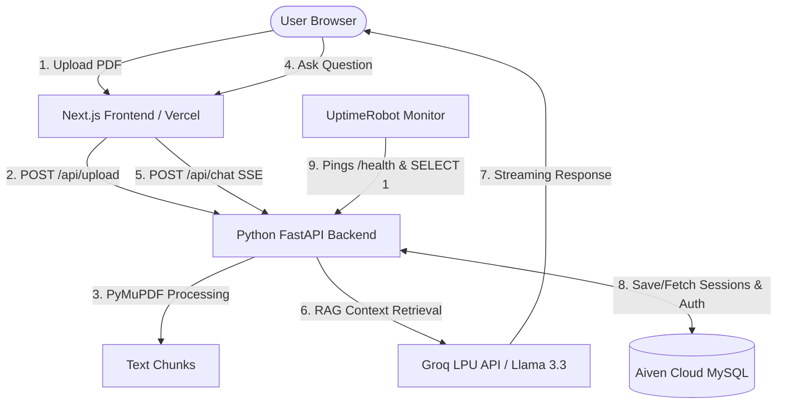

# 🧠 DocMind AI — Complete End-to-End Project Architecture & Deployment Guide

> **Author**: DocMind AI Development Team  
> **Repository**: [GitHub — SarthakR0401/DocMind-AI](https://github.com/SarthakR0401/DocMind-AI)  
> **Tech Stack**: Next.js 14, Python FastAPI, Groq Llama 3.3 70B, PyMuPDF, Aiven Cloud MySQL, UptimeRobot, Vercel  

---

## 📌 Table of Contents

1. [Project Overview](#1-project-overview)
2. [Full Technology Stack](#2-full-technology-stack)
3. [System Architecture & Workflow](#3-system-architecture--workflow)
4. [Key Features & UX Innovations](#4-key-features--ux-innovations)
5. [Database Architecture (Aiven Cloud MySQL)](#5-database-architecture-aiven-cloud-mysql)
6. [Why UptimeRobot is Used (Keep-Alive & Uptime Strategy)](#6-why-uptimerobot-is-used-keep-alive--uptime-strategy)
7. [Step-by-Step Local Setup Guide](#7-step-by-step-local-setup-guide)
8. [Complete Production Deployment Guide](#8-complete-production-deployment-guide)
9. [Git & Project Maintenance](#9-git--project-maintenance)

---

## 1. Project Overview

**DocMind AI** is an enterprise-grade, high-performance AI document assistant. It enables users to upload PDF documents of any length, extract structured knowledge instantly using **PyMuPDF**, and engage in natural language conversations powered by **Groq LPU (Llama 3.3 70B)**.

### Primary Objectives
- **Zero Latency RAG**: Stream AI responses in milliseconds using Groq’s LPU infrastructure.
- **Enterprise Persistence**: Store user profiles and chat transcripts securely in an **Aiven Cloud MySQL** database.
- **Always-On Availability**: Leverage **UptimeRobot** health pings to keep cloud backends warm and maintain active Aiven MySQL connection pools.
- **Premium UX**: Theme-aware Skeleton Shimmer loading, guided first-time onboarding tour, and dark/light mode UI.

---

## 2. Full Technology Stack

### 🎨 Frontend (Next.js App Router)
- **Framework**: Next.js 14 (React 18, TypeScript)
- **Styling**: Vanilla CSS Design System (`globals.css`), Tailwind CSS, CSS Grid/Flexbox
- **Authentication**: NextAuth.js (Google OAuth 2.0) & Custom Backend Credentials
- **Icons**: `lucide-react`
- **Markdown Parsing**: `react-markdown`

### ⚡ Backend API (Python FastAPI)
- **Framework**: FastAPI (High-performance async ASGI server)
- **ASGI Server**: Uvicorn
- **PDF Extraction**: PyMuPDF (`fitz`) — 10x faster than traditional PDF parsers
- **OCR Fallback**: OCR.space REST API integration for scanned documents
- **Database Driver**: `mysql-connector-python` with `pooling.MySQLConnectionPool`

### ☁️ Cloud Infrastructure & Services
- **Database Storage**: Aiven Cloud Managed MySQL (SSL encrypted with `ca.pem`)
- **AI Acceleration**: Groq Cloud API (Llama 3.3 70B Model)
- **Uptime & Keep-Alive**: UptimeRobot (5-minute interval HTTP/HEAD pings)
- **Frontend Hosting**: Vercel Cloud Platform

---

## 3. System Architecture & Workflow



### Data Flow Execution Steps:
1. **Document Upload**: User uploads a PDF via drag-and-drop.
2. **Text Extraction & Chunking**: PyMuPDF extracts text per page and divides it into optimal overlapping context chunks.
3. **Retrieval-Augmented Generation (RAG)**: When a question is submitted, context-matching text chunks are sent along with conversation history to Groq Llama 3.3 70B.
4. **Server-Sent Events (SSE) Streaming**: Answers stream character-by-character back to the UI.
5. **Persistence**: Chat sessions and user accounts are saved to Aiven Cloud MySQL.

---

## 4. Key Features & UX Innovations

### 🌟 1. Theme-Aware Skeleton (Shimmer) Loading
- **Purpose**: Eliminates abrupt layout shifts and blank loading screens.
- **Light Mode Palette**: Refined Metallic Slate (`#E2E8F0` → `#F8FAFC` → `#E2E8F0`).
- **Dark Mode Palette**: Obsidian Slate (`#1E293B` → `#334155` → `#1E293B`).
- **Fade-In Transition**: Smooth `300ms` fade-in animation (`animate-fade-in`) when content finishes loading.

### 🧭 2. Guided First-Time Onboarding Tour (`OnboardingTour.tsx`)
- **Automated Trigger**: Launches automatically for first-time users via `localStorage` tracking (`docmind_tour_completed_<email>`).
- **Spotlight Cutout**: SVG mask dims the background while framing target UI sections with glowing animated borders.
- **6-Step Interactive Walkthrough**:
  1. Workspace Overview (`dashboard-overview`)
  2. Sidebar Navigation (`nav-menu`)
  3. PDF Upload Zone (`upload-zone`)
  4. Primary Actions & PDF Export (`sidebar-actions`)
  5. Interactive Chat & Split-Screen Preview (`chat-input`)
  6. User Profile & Settings (`user-profile`)
- **Re-Take Tour Option**: Includes a permanent "Take Product Tour" button in the sidebar.

### 📄 3. Integrated PDF Split-Screen Previewer
- Side-by-side view of the original PDF alongside the AI chat box on desktop.
- Responsive toggle button (`Eye` / `EyeOff`) to maximize chat width when preview is hidden.

### 💾 4. Session Export & Shareable Links (`/share/[id]`)
- Export chat transcripts into print-formatted PDFs.
- Generate shareable links for teammates to view transcripts without needing an account.

---

## 5. Database Architecture (Aiven Cloud MySQL)

The backend connects to a managed **Aiven Cloud MySQL** cluster using SSL verification (`ca.pem`). Connection pooling (`pooling.MySQLConnectionPool`) manages concurrent database requests.

### Database Tables Schema

#### 1. `users` Table
Stores user registration profiles for custom email/password authentication.
```sql
CREATE TABLE IF NOT EXISTS users (
    id INT AUTO_INCREMENT PRIMARY KEY,
    email VARCHAR(255) UNIQUE NOT NULL,
    password_hash VARCHAR(255) NOT NULL,
    name VARCHAR(255) NOT NULL,
    created_at TIMESTAMP DEFAULT CURRENT_TIMESTAMP
);
```

#### 2. `chat_sessions` Table
Stores full conversation transcripts, document metadata, and text chunks.
```sql
CREATE TABLE IF NOT EXISTS chat_sessions (
    id VARCHAR(255) PRIMARY KEY,
    email VARCHAR(255) NOT NULL,
    pdf_name VARCHAR(255) NOT NULL,
    pdf_pages INT DEFAULT 0,
    word_count INT DEFAULT 0,
    chunks LONGTEXT,
    messages LONGTEXT,
    timestamp VARCHAR(255) NOT NULL,
    count INT DEFAULT 0,
    created_at TIMESTAMP DEFAULT CURRENT_TIMESTAMP,
    INDEX idx_email (email)
);
```

---

## 6. Why UptimeRobot is Used (Keep-Alive & Uptime Strategy)

### ❓ The Problem
Cloud platforms (like Render, Railway, Vercel serverless functions, and free/managed DB tiers like Aiven) automatically put inactive services into **sleep mode** or close idle database socket connections after periods of inactivity. This leads to:
- **Cold Start Delays**: Users experience 10-30 second lag when loading the app after idle periods.
- **Closed DB Sockets**: Idle MySQL connections get terminated by network firewalls.

### 💡 The UptimeRobot Solution
We configured **UptimeRobot** (a free 24/7 uptime monitoring service) to send HTTP `GET`/`HEAD` requests to the backend endpoints every **5 minutes**:
- **Target Endpoints**: `https://<your-backend-api>/` and `https://<your-backend-api>/health`

### 🔧 Backend Connection Warm-up (`server.py`)
Whenever UptimeRobot pings the backend, `server.py` executes a lightweight `SELECT 1` query on the Aiven MySQL pool:

```python
@app.get("/")
@app.head("/")
@app.get("/health")
@app.head("/health")
async def root():
    db_status = "Disconnected"
    db_error = None
    try:
        conn = get_db_connection()
        cursor = conn.cursor()
        cursor.execute("SELECT 1") # <--- Keeps Aiven MySQL connection pool active
        cursor.fetchone()
        cursor.close()
        conn.close()
        db_status = "Connected"
    except Exception as e:
        db_error = str(e)
        
    return {
        "status": "Online",
        "service": "DocMind AI Backend",
        "database": db_status,
        "timestamp": datetime.datetime.now().isoformat()
    }
```

### ✅ Benefits Achieved:
1. **Zero Cold Starts**: The FastAPI server remains active in memory.
2. **Active MySQL Pool**: Prevents Aiven Cloud from closing idle DB connections.
3. **Instant Initial Load**: Users get immediate response times upon opening the web app.

---

## 7. Step-by-Step Local Setup Guide

### Prerequisites
- **Node.js**: v18+ and `npm`
- **Python**: v3.10+ and `pip`
- **Git**

---

### Step 1: Configure Environment Variables

#### Backend `.env` (in project root `d:\genai-support-assistant\.env`):
```env
GROQ_API_KEY="gsk_your_groq_api_key"
DB_HOST="your-aiven-db-host.aivencloud.com"
DB_USER="avnadmin"
DB_PASSWORD="your-aiven-db-password"
DB_NAME="defaultdb"
DB_PORT=25232
```

#### Frontend `.env.local` (inside `docmind/.env.local`):
```env
NEXT_PUBLIC_API_URL="http://localhost:8000"
NEXTAUTH_SECRET="your-random-secret-key"
NEXTAUTH_URL="http://localhost:3000"
GOOGLE_CLIENT_ID="your-google-client-id"
GOOGLE_CLIENT_SECRET="your-google-client-secret"
```

---

### Step 2: Start Python Backend Server

Open Terminal 1:
```bash
# 1. Install dependencies
pip install -r requirements.txt

# 2. Run FastAPI server
python server.py
```
*Backend runs on `http://localhost:8000`*

---

### Step 3: Start Next.js Frontend Server

Open Terminal 2:
```bash
# 1. Navigate to frontend folder
cd docmind

# 2. Install node dependencies (if first time)
npm install

# 3. Start Next.js dev server
npm run dev
```
*Frontend runs on `http://localhost:3000`*

---

### Step 4: Access Application
Open your browser and navigate to:
👉 **[http://localhost:3000](http://localhost:3000)**

---

## 8. Complete Production Deployment Guide

### Phase 1: Aiven Cloud MySQL Setup
1. Create a MySQL service in [Aiven Console](https://console.aiven.io/).
2. Download the SSL CA certificate (`ca.pem`) and place it in the backend root directory (`d:\genai-support-assistant\ca.pem`).
3. Note your Connection Host, Port, User, and Password.

### Phase 2: Deploy Backend (Render / Railway / VPS)
1. Push backend code to GitHub.
2. Create a Web Service on Render or Railway linking your repository.
3. Build Command: `pip install -r requirements.txt`
4. Start Command: `python server.py` or `uvicorn server:app --host 0.0.0.0 --port $PORT`
5. Add environment variables (`GROQ_API_KEY`, `DB_HOST`, `DB_USER`, `DB_PASSWORD`, `DB_NAME`, `DB_PORT`).

### Phase 3: Deploy Frontend (Vercel)
1. Import `docmind` directory into [Vercel](https://vercel.com).
2. Set Environment Variables:
   - `NEXT_PUBLIC_API_URL`: Your deployed backend URL (e.g. `https://docmind-backend.onrender.com`)
   - `NEXTAUTH_SECRET`: Random secret key
   - `NEXTAUTH_URL`: Your Vercel domain (e.g. `https://docminds-ai.vercel.app`)

### Phase 4: Configure UptimeRobot Keep-Alive
1. Create a free account at [UptimeRobot.com](https://uptimerobot.com).
2. Click **Add New Monitor**:
   - **Monitor Type**: `HTTP(s)`
   - **Friendly Name**: `DocMind AI Backend Keep-Alive`
   - **URL**: `https://<your-backend-api-url>/health`
   - **Monitoring Interval**: Every 5 minutes
3. Click **Create Monitor**.

---

## 9. Git & Project Maintenance

### Staging & Pushing Updates:
```bash
git status
git add .
git commit -m "feat: add feature description"
git pull --rebase origin main
git push origin main
```

---

## 📄 License & Credits
- **Developer**: DocMind AI Core Team
- **AI Model**: Llama 3.3 70B via Groq LPU Cloud
- **Database**: Aiven Cloud Managed MySQL
- **Frontend & Deployment**: Next.js & Vercel
